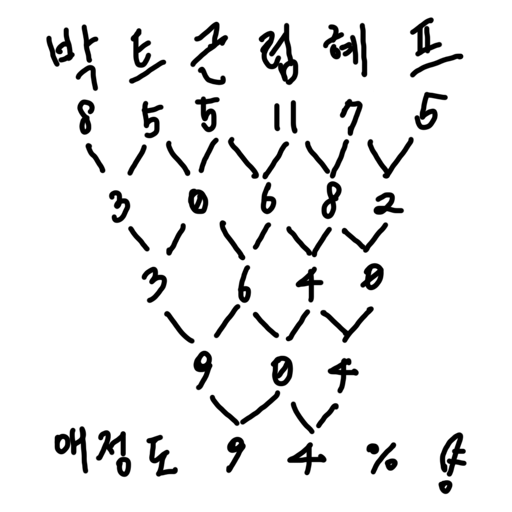

# gunghap.js

궁합 계산용 nodejs 라이브러리



Example:

```
import gunghap from "gunghap.js"
for (const step of gunghap("박근혜", "트럼프")) {
    console.log(step);
}
# [ '박', '트', '근', '럼', '혜', '프' ]
# [ 8, 5, 5, 11, 7, 5 ]
# [ 3, 0, 6, 8, 2 ]
# [ 3, 6, 4, 0 ]
# [ 9, 0, 4 ]
# [ 9, 4 ]
# 94
```
